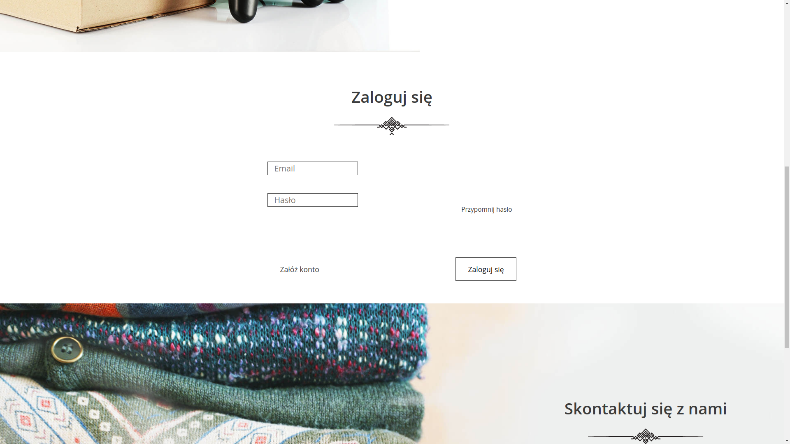

# Projekt portfolioLab.

## Wykorzystane technologie:
- Spring MVC
- Spring Form
- Hibernate
- Spring Security

## funkcjonalności
1. Strona główna.

2. Profil użytkownika:
     - rejestracja,
     - logowanie,
     

     - edycja własnego profilu,
     - dodawanie darów,
     
     
     

     - przeglądanie, edycja, kasowanie przekazanych darów,
     - zaznaczenie, że dar został komuś oddany.
     

